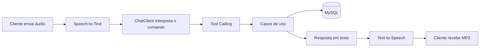

# Budgeting AI API

API inteligente de orçamento criada como entrega do desafio **Spring Boot + Spring AI** da [Digital Innovation One](https://github.com/digitalinnovationone/dio-spring-boot-learning-track/tree/main/05-spring-ai). A aplicação recebe comandos financeiros por áudio, transcreve a fala, usa IA para escolher uma função da aplicação e devolve a resposta em voz.

## Fluxo principal



A mesma regra de negócio é utilizada pelos endpoints REST e pelas ferramentas chamadas pela IA. Assim, o modelo não acessa o banco de dados diretamente.

## Minha evolução

Implementei uma camada de validação para impedir que transações inválidas cheguem à persistência, independentemente de terem sido criadas pelo endpoint REST ou por Tool Calling.

- descrição obrigatória, normalizada e limitada a 120 caracteres;
- valor obrigatoriamente maior que zero;
- categoria obrigatória;
- resposta HTTP padronizada com `ProblemDetail` e status `422 Unprocessable Content`;
- correção da conversão de centavos para reais na resposta;
- testes unitários do caso de uso, sem depender de OpenAI ou MySQL;
- banco H2 em memória para os testes de contexto.

Exemplo de erro:

```json
{
  "type": "about:blank",
  "title": "Transação inválida",
  "status": 422,
  "detail": "O valor da transação deve ser maior que zero."
}
```

## Tecnologias

- Java 21;
- Spring Boot 4;
- Spring AI;
- OpenAI (chat, transcrição e geração de voz);
- Spring Data JPA;
- MySQL e H2 para testes;
- Gradle;
- JUnit 5;
- Docker Compose.

## Arquitetura

```text
src/main/java/dio/budgeting
├── domain          # Entidades, identificadores e contratos
├── application     # Casos de uso compartilhados por REST e IA
└── infrastructure  # Controllers HTTP e persistência JPA
```

## Pré-requisitos

- JDK 21;
- Docker Desktop ou uma instância MySQL compatível;
- chave da API da OpenAI para utilizar o fluxo de voz.

O Gradle não precisa ser instalado, pois o repositório inclui o Gradle Wrapper.

## Como executar

No PowerShell:

```powershell
$env:OPENAI_API_KEY="sua-chave-aqui"
.\gradlew.bat bootRun
```

No Linux ou macOS:

```bash
export OPENAI_API_KEY="sua-chave-aqui"
./gradlew bootRun
```

O suporte do Spring Boot ao Docker Compose inicia o MySQL descrito em `compose.yml`. Por padrão, a API fica disponível em `http://localhost:8080`.

> Nunca salve sua chave da OpenAI no repositório. Use somente a variável de ambiente.

## Como testar

Execute os testes automatizados:

```powershell
.\gradlew.bat test
```

Os testes de integração com a OpenAI só são executados quando `OPENAI_API_KEY` está definida. Os demais usam H2 e não consomem créditos da API.

### Criar uma transação

Os valores são enviados em centavos. Neste exemplo, `2590` representa R$ 25,90.

```bash
curl -X POST http://localhost:8080/transactions \
  -H "Content-Type: application/json" \
  -d '{"description":"Supermercado","category":"GROCERIES","amount":2590}'
```

Resposta esperada:

```json
{
  "id": "9d3571ac-1a1d-40bc-87ed-5f1b34684ea1",
  "category": "GROCERIES",
  "description": "Supermercado",
  "amount": 25.9
}
```

### Consultar por categoria

Categorias disponíveis: `GROCERIES`, `PHARMA` e `AUTO`.

```bash
curl http://localhost:8080/transactions/GROCERIES
```

### Enviar um comando de voz

```bash
curl -X POST http://localhost:8080/transactions/ai \
  -F "file=@comando.m4a" \
  --output resposta.mp3
```

Exemplos de comandos: "Gastei vinte e cinco reais no supermercado" ou "Quais foram os meus gastos com farmácia?".

## O que aprendi

- como configurar modelos de chat, transcrição e voz no Spring AI;
- como o `ChatClient` decide quando chamar uma ferramenta;
- como reaproveitar casos de uso entre uma API REST e um assistente de IA;
- por que as regras de negócio precisam ficar fora do modelo de linguagem;
- como testar a lógica principal sem chamar serviços externos;
- como representar valores monetários em centavos para evitar erros de ponto flutuante na persistência.

## Referências

- [Trilha Spring Boot da DIO](https://github.com/digitalinnovationone/dio-spring-boot-learning-track)
- [Projeto-base Spring AI](https://github.com/digitalinnovationone/dio-spring-boot-learning-track/tree/main/05-spring-ai)
- [Documentação do Spring AI](https://docs.spring.io/spring-ai/reference/)

Projeto desenvolvido para fins educacionais como parte de um desafio da DIO.
